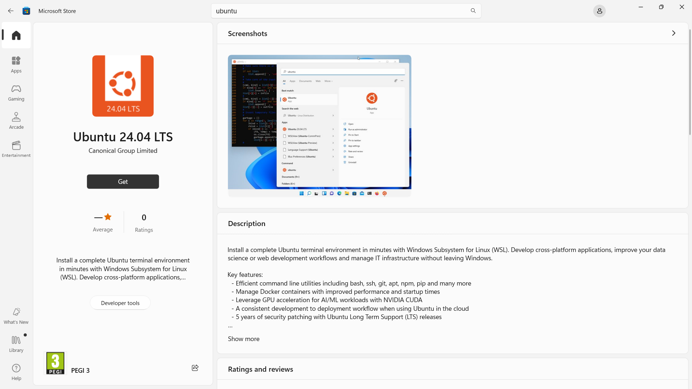

# Install Ubuntu on WSL2

## What you will learn

* How to enable and install WSL on Windows 10 and Windows 11
* How to install `Ubuntu 24.04 LTS` using the Microsoft Store or WSL commands in the terminal

## What you will need

* Windows 10 or 11 running on either a physical device or virtual machine 
* All of the latest Windows updates installed

## Install WSL

You can install WSL from the command line. Open a PowerShell prompt as an Administrator (we recommend using [Windows Terminal](https://github.com/microsoft/terminal?tab=readme-ov-file#installing-and-running-windows-terminal)) and run:


```{code-block} text
> wsl --install
```

It is recommended to reboot your machine after this initial installation to complete the setup.

## Install Ubuntu WSL

There are multiple ways of installing distros on WSL, here we focus on two: the Microsoft Store application and WSL commands run in the terminal. The result is the same regardless of the method.

### Method 1: Microsoft Store application

Find the distribution you prefer on the Microsoft Store and then click **Get**. 



Ubuntu will then be installed on your machine. Once installed, you can either launch the application directly from the Microsoft Store or search for Ubuntu in your Windows search bar.


### Method 2: WSL commands in the terminal

In a PowerShell terminal, you can run `wsl --list --online` to see an output with all available distros and versions:

```{code-block} text
:class: no-copy
The following is a list of valid distributions that can be installed.
The default distribution is denoted by '*'.
Install using 'wsl --install -d <Distro>'.

  NAME                                   FRIENDLY NAME
* Ubuntu                                 Ubuntu
  Debian                                 Debian GNU/Linux
  kali-linux                             Kali Linux Rolling
  Ubuntu-18.04                           Ubuntu 18.04 LTS
  Ubuntu-20.04                           Ubuntu 20.04 LTS
  Ubuntu-22.04                           Ubuntu 22.04 LTS
  Ubuntu-24.04                           Ubuntu 24.04 LTS
...

``` 

Your list may be different once new distributions become available.  

You can install a version using a NAME from the output:

```{code-block} text
> wsl --install -d Ubuntu-24.04
```

You'll see an indicator of the installation progress in the terminal:

```{code-block} text
:class: no-copy
Installing: Ubuntu 24.04 LTS
[==========================72,0%==========                 ]
```

Use `wsl -l -v` to see all your currently installed distros and the version of WSL that they are using:

```{code-block} text
:class: no-copy
  NAME            STATE           VERSION
  Ubuntu-20.04    Stopped         2
* Ubuntu-24.04    Stopped         2
```

## Note on installing images without the Microsoft Store

If you do not have access to the Microsoft Store or need to install
a custom image it is possible to import a distribution as a tar file:

```{code-block} text
> wsl --import <DistroName> <InstallLocation> <InstallTarFile>
```
Appx and MSIX packages for a given distro can also be downloaded and installed.
Please refer to Microsoft's documentation for more detailed information on these installation methods:

- [Importing Linux distributions](https://learn.microsoft.com/en-us/windows/wsl/use-custom-distro)
- [Installing distributions without the Microsoft Store](https://learn.microsoft.com/en-us/windows/wsl/install-manual#downloading-distributions) 

```{warning}
You should always try to use the latest LTS release of Ubuntu, as it offers the best security, reliability and support when using Ubuntu WSL.

Currently we do not have a recommended store for downloading tar and Appx/MSIX files for Ubuntu distros. 
```

## Run and configure Ubuntu

To open an Ubuntu 24.04 terminal run the following command in PowerShell:

```{code-block} text
> ubuntu2404.exe 
```

Once it has finished its initial setup, you will be prompted to create a username and password. They don't need to match your Windows user credentials.

Finally, it’s always good practice to install the latest updates by running the following commands within the Ubuntu terminal, entering your password when prompted:

```{code-block} text
$ sudo apt update
$ sudo apt full-upgrade -y
```

## Enjoy Ubuntu on WSL

In this guide, we’ve shown you how to install Ubuntu WSL on Windows 10 or 11.

We hope you enjoy working with Ubuntu in WSL. Don’t for to check out [our blog](https://ubuntu.com/blog) for the latest news on all things Ubuntu.

### Further Reading

* [Setting up WSL for Data Science](https://ubuntu.com/blog/upgrade-data-science-workflows-ubuntu-wsl)
* [Whitepaper: Ubuntu WSL for Data Scientists](https://ubuntu.com/engage/ubuntu-wsl-for-data-scientists)
* [Microsoft WSL Documentation](https://learn.microsoft.com/en-us/windows/wsl/)
* [Ask Ubuntu](https://askubuntu.com/)
